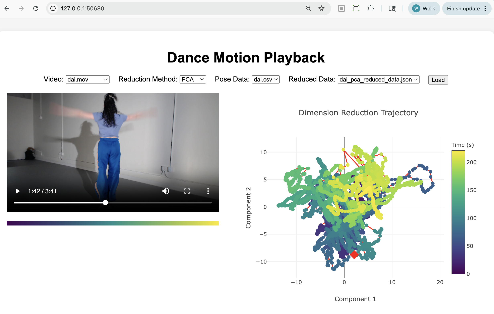

# Dance Motion Embedding System

A comprehensive system for converting dance videos into pose time series data using MediaPipe's AI pose estimation, generating vector embeddings for poses and movement segments, and enabling motion analysis in high-dimensional space.

## 🎯 Features

- **Pose Extraction**: Extract 2D and 3D pose landmarks from dance videos using MediaPipe
- **Embedding Generation**: Create vector embeddings for individual poses and 5-second movement segments
- **Motion Analysis**: Analyze motion patterns using dimensionality reduction and clustering
- **Visualization**: Interactive 3D visualizations using Plotly and Rerun
- **Live Prediction**: Framework for predicting future movements during live tracking
- **CSV Export**: Export pose data with timestamps for synchronized playback
- **🎭 Dance Recall System**: Real-time pose matching and video recall using live camera or video input
- **📡 OSC Streaming**: Real-time pose data streaming via Open Sound Control protocol

## 🚀 Quick Start - Dance Recall System

**Want to test the system quickly? Start here!**

### 1. Install Dependencies
```bash
# Clone and setup
git clone git@github.com:kinetecharts/dance-embedding.git
cd dance_embedding

# Create virtual environment with Python 3.9
uv venv --python 3.9
source .venv/bin/activate

# Install dependencies
uv pip install -e .
```

### 2. Extract Pose Data (One-time setup)
```bash
# Create data directories
mkdir -p data/video data/poses

# Add some dance videos to data/video/
# Then extract poses from all videos
python -m pose_extraction.main --input-dir data/video
```

### 3. Build LanceDB Database (One-time setup)
```bash
# Build the LanceDB vector database for fast pose matching
python rebuild_database.py
```

### 4. Test with Live Camera
```bash
# Start real-time pose matching with camera
python -m recall.main --mode camera --top-n 1 --match-interval 2.0 --playback-duration 3.0
```

### 4. Test with Video File
```bash
# Analyze a specific video file
python -m recall.main --mode video --input data/video/your_video.mp4 --top-n 1 --match-interval 2.0
```

### What You'll See
- **Left Window**: Live camera/video feed with red pose skeleton
- **Right Window**: Matched reference video frame with green pose dots
- **Overlay Info**: Match details (video name, timestamp, similarity score)
- **Controls**: Press 'q' to quit, 'p' to pause, 'r' to reset

### Performance Tips
- Use `--top-n 1` for fastest matching
- Use `--match-interval 2.0` or higher for better performance
- Ensure good lighting for camera mode
- Works best with 3-10 reference videos in database

## 🏗️ Architecture

The system consists of four main components:

1. **Pose Extraction** (`src/pose_extraction/`): Uses MediaPipe and Rerun to extract pose landmarks from videos
2. **Dimension Reduction** (`src/dimension_reduction/`): Creates visualizations and interactive analysis
3. **Embedding Generation** (planned): Will create vector embeddings using Transformer or LSTM models
4. **🎭 Dance Recall System** (`src/recall/`): Real-time pose matching and video recall with live camera support

## 📦 Installation

### Prerequisites

- **Python 3.9** (required; other versions are not supported due to MediaPipe and UMAP dependencies)
- [uv](https://docs.astral.sh/uv/) (recommended) or pip

### Quick Installation

1. **Clone the repository**:
   ```bash
   git@github.com:kinetecharts/dance-embedding.git
   cd motion_embedding
   ```

2. **Install Python 3.9** (if not already installed):
   - On macOS:
     ```bash
     brew install python@3.9
     ```
   - Or use [pyenv](https://github.com/pyenv/pyenv):
     ```bash
     pyenv install 3.9.18
     pyenv local 3.9.18
     ```

3. **Create and activate a virtual environment with Python 3.9**:
   ```bash
   uv venv --python 3.9
   source .venv/bin/activate
   ```

4. **Install using uv** (recommended):
   ```bash
   # Install uv if not already installed
   curl -LsSf https://astral.sh/uv/install.sh | sh
   
   # Install dependencies
   uv pip install -e .
   ```

5. **Or install using pip**:
   ```bash
   pip install -e .
   ```

6. **Run the installation script** (optional):
   ```bash
   python install.py
   ```

## 🎭 Dance Recall System - Detailed Guide

The Dance Recall System enables real-time pose matching and video recall, allowing you to find similar dance movements from a database of pre-recorded videos while performing live or analyzing video files.

### Features

- **Real-time Pose Matching**: Match live camera poses against a database of dance movements
- **Video Input Support**: Analyze pre-recorded videos for pose matching
- **Side-by-Side Display**: View live pose and matched reference pose simultaneously
- **Multiple Video Support**: Match against multiple dance videos in the database
- **Configurable Matching**: Adjust matching frequency, top-N results, and playback duration
- **Performance Metrics**: Real-time FPS and match statistics

### Quick Start with Dance Recall

1. **Ensure you have pose data ready**:
   ```bash
   # Extract poses from your dance videos first
   python -m pose_extraction.main --input-dir data/video
   ```

2. **Build LanceDB database for fast matching**:
   ```bash
   # Create vector database for efficient pose matching
   python rebuild_database.py
   ```

3. **Run with live camera**:
   ```bash
   # Start real-time pose matching with camera
   python -m recall.main --mode camera --top-n 3 --match-interval 1.0 --playback-duration 3.0
   ```

3. **Run with video file**:
   ```bash
   # Analyze a specific video file
   python -m recall.main --mode video --input data/video/dance_video.mp4 --top-n 3 --match-interval 2.0 --playback-duration 3.0
   ```

### What You'll See

When running the Dance Recall System, you'll see a window titled "Dance Recall System" with:

- **Left Side**: Live camera feed or input video with red pose skeleton overlay
- **Right Side**: Matched reference video frame with green pose dots overlay
- **Overlay Information**: Match details including video name, timestamp, and similarity score

### Command Line Options

```bash
python -m recall.main [OPTIONS]

Options:
  --mode {camera,video}          Input mode: camera or video file
  --input PATH                   Input video file (required for video mode)
  --top-n INTEGER               Number of top matches to consider (default: 3)
  --match-interval FLOAT        Interval between matches in seconds (default: 2.0)
  --playback-duration FLOAT     Duration to display each match (default: 3.0)
  --pose-dir PATH               Directory containing pose CSV files (default: data/poses)
  --video-dir PATH              Directory containing video files (default: data/video)
```

### Examples

**Live Camera Mode**:
```bash
# Basic camera mode with default settings
python -m recall.main --mode camera

# Camera mode with custom settings
python -m recall.main --mode camera --top-n 5 --match-interval 0.5 --playback-duration 5.0
```

**Video File Mode**:
```bash
# Analyze a specific video file
python -m recall.main --mode video --input data/video/Dai2.mov

# Analyze with custom settings
python -m recall.main --mode video --input data/video/dance.mp4 --top-n 3 --match-interval 1.0
```

**Custom Data Directories**:
```bash
# Use custom pose and video directories
python -m recall.main --mode camera --pose-dir /path/to/poses --video-dir /path/to/videos
```

### Controls

While the system is running:
- **Press 'q'**: Quit the application
- **Press 'p'**: Pause/resume matching
- **Press 'r'**: Reset match display
- **Press '1-9'**: Select top-N matches (1-9)

### Performance Tips

1. **Optimize for Real-time**: Use `--match-interval 1.0` or higher for better performance
2. **Reduce Top-N**: Use `--top-n 3` instead of higher values for faster matching
3. **Camera Quality**: Ensure good lighting and clear camera view for better pose detection
4. **Database Size**: The system works best with 3-10 reference videos in the database

### Troubleshooting

**No matches found**:
- Ensure pose CSV files exist in `data/poses/`
- Check that video files are in `data/video/`
- Verify pose extraction was completed successfully

**Poor performance**:
- Reduce `--top-n` value
- Increase `--match-interval`
- Close other applications to free up CPU/GPU resources

**Camera not working**:
- Ensure camera permissions are granted
- Try a different camera if available
- Check camera is not being used by another application

### LanceDB Database Management

The Dance Recall System uses LanceDB for efficient vector similarity search. The database stores pose embeddings for fast matching.

#### Building the Database

**Initial Setup**:
```bash
# Extract poses from videos first
python -m pose_extraction.main --input-dir data/video

# Build LanceDB database
python rebuild_database.py
```

**Rebuilding the Database**:
```bash
# Rebuild database (clears existing data)
python rebuild_database.py
```

**Custom Database Path**:
```python
from recall.pose_embedding import create_pose_database

# Create database with custom path
database = create_pose_database(
    pose_dir="data/poses",
    video_dir="data/video", 
    db_path="data/custom_database.lancedb"
)
```

#### Database Information

The LanceDB database contains:
- **32-dimensional pose embeddings** for efficient similarity search
- **Video metadata** (filename, timestamp, frame number)
- **Pose landmarks** and confidence scores
- **Indexed vectors** for fast L2 and cosine similarity search

#### Database Files

- **Location**: `data/pose_database.lancedb/` (excluded from git)
- **Size**: ~10-50MB per 1000 poses (depends on video count)
- **Format**: LanceDB vector database with embedded metadata

#### Performance

- **Search Speed**: ~1-5ms per query (vs 100-500ms for CSV search)
- **Memory Usage**: ~100-500MB for typical dance video collections
- **Scalability**: Supports 10,000+ poses efficiently

#### Troubleshooting Database Issues

**Database not found**:
```bash
# Rebuild database
python rebuild_database.py
```

**Poor search performance**:
```bash
# Check database stats
python -c "from recall.pose_embedding import LanceDBPoseDatabase; db = LanceDBPoseDatabase(); print(db.get_database_stats())"
```

**Database corruption**:
```bash
# Remove and rebuild
rm -rf data/pose_database.lancedb
python rebuild_database.py
```

## 🚀 Quick Start - Full System

Get up and running in minutes with these simple steps:

1. **Create the data directory structure**:
   ```bash
   mkdir -p data/video data/poses data/analysis/dimension_reduction
   ```

2. **Add a dance video file**:
   ```bash
   # Copy your dance video to the data/video folder
   cp /path/to/your/dance_video.mp4 data/video/
   ```

3. **Extract pose data from the video**:
   ```bash
   # Process all videos in data/video (default)
   python -m pose_extraction.main
 
   # or specify video
   python -m pose_extraction.main --video data/video/dance_video.mp4
   ```
   This will create a CSV file with pose landmarks in `data/poses/` and an overlay video in `data/video_with_pose/` for review.

4. **Run dimension reduction and create visualizations**:
   ```bash
   # Generate CSV data only (fastest)
   python -m dimension_reduction.main --video data/video/dance_video.mp4 --pose-csv data/poses/dance_video.csv
   
   # Or create interactive HTML visualization
   python -m dimension_reduction.main --video data/video/dance_video.mp4 --pose-csv data/poses/dance_video.csv --save-html
   ```
   This generates CSV files in `data/dimension_reduction/` for analysis.

5. **Start the web application server**:
   ```bash
   cd src/viewer/webapp
   python server.py
   ```
   Open your browser to [http://127.0.0.1:50680/](http://127.0.0.1:50680/) to view interactive visualizations with synchronized video playback.

   

### Automatic Processing with Monitor

For automatic processing of new videos as they are added:

```bash
# Start the monitor script to watch for new videos
python monitor_videos.py
```

This script will:
- Watch the `data/video/` directory for new video files
- Automatically run pose extraction when a new video is detected
- Run dimension reduction for all methods (PCA, t-SNE, UMAP) on the extracted pose data
- Process videos in the background while you continue working

**Note:** The first time you run pose extraction (either manually or via monitor), it may take several minutes as MediaPipe downloads its AI models (~100MB). Subsequent runs will be much faster.

### Data Requirements

The Dance Recall System requires:

1. **Pose CSV Files**: Extracted pose data in `data/poses/` directory
2. **Video Files**: Original video files in `data/video/` directory
3. **File Naming**: Pose CSV files should match video file names (e.g., `Dai2.csv` for `Dai2.mov`)

### Advanced Usage

**Custom Pose Matching**:
```python
from recall.pose_matcher import PoseMatcher
from recall.config import RecallConfig

# Initialize matcher
config = RecallConfig()
matcher = PoseMatcher(config)

# Find matches for a pose
matches = matcher.find_matches(pose_data, top_n=3)
```

**Video Player Integration**:
```python
from recall.video_player import VideoPlayer
from recall.config import RecallConfig

# Initialize video player
config = RecallConfig()
player = VideoPlayer(config)

# Display matched pose
player.display_live_frame(frame, pose_data, match_info)
```

### Development Setup

For development, install with additional dependencies:

```bash
uv pip install -e ".[dev]"
```

## 🚀 Quick Usage

### Command Line Interface

Extract poses from a single video:
```bash
python -m pose_extraction.main --video data/video/dance.mp4
```

Extract poses from all videos in a directory:
```bash
python -m pose_extraction.main --input-dir data/video
```

Use Rerun visualization:
```bash
python -m pose_extraction.main --video data/video/dance.mp4 --use-rerun
```

### Python API

```python
from pose_extraction import PoseExtractionPipeline

# Initialize pipeline
pipeline = PoseExtractionPipeline(use_rerun=False)  # Set to True for visualization

# Run pose extraction pipeline
results = pipeline.run_full_pipeline("data/video/dance.mp4")

print(f"Pose data: {results['pose_csv_path']}")
```

### Individual Components

```python
from pose_extraction import PoseExtractor

# Extract poses
extractor = PoseExtractor(use_rerun=True)
pose_data = extractor.extract_pose_from_video("data/video/dance.mp4")
```

## 📁 Project Structure

```
motion_embedding/
├── src/pose_extraction/
│   ├── __init__.py              # Main package
│   ├── pose_extraction.py       # Pose extraction using MediaPipe
│   └── main.py                  # Pose extraction pipeline
├── src/dimension_reduction/
│   ├── main.py                  # Dimension reduction and visualization
│   ├── visualizer.py            # Visualization tools
│   └── reduction_methods.py     # Dimension reduction algorithms
├── src/recall/
│   ├── __init__.py              # Dance recall system package
│   ├── main.py                  # Main recall system entry point
│   ├── recall_system.py         # Core recall system logic
│   ├── pose_matcher.py          # Pose matching algorithms
│   ├── pose_normalizer.py       # Pose normalization utilities
│   ├── video_player.py          # Video playback and display
│   ├── data_structures.py       # Data classes and structures
│   └── config.py                # Configuration management
├── src/viewer/
│   └── webapp/                  # Web application for viewing results
├── data/
│   ├── video/                   # Input video files
│   ├── poses/                   # Extracted pose CSV files
│   ├── video_with_pose/         # Videos with pose overlays for review
│   └── dimension_reduction/     # Dimension reduction results
├── examples/
│   └── basic_usage.py           # Usage examples
├── tests/
│   └── test_imports.py          # Basic tests
├── documents/                   # Documentation
├── pyproject.toml              # Project configuration
├── install.py                  # Installation script
└── README.md                   # This file
```

## 📊 Data Formats

### Pose CSV Format

The system exports pose data in CSV format with the following columns:

- `timestamp`: Frame timestamp in seconds
- `frame_number`: Frame index
- `{keypoint}_x`, `{keypoint}_y`: 2D coordinates for each keypoint
- `{keypoint}_z`: 3D coordinates (if available)
- `{keypoint}_confidence`: Confidence scores

Example:
```csv
timestamp,frame_number,nose_x,nose_y,nose_z,nose_confidence,...
0.0,0,320.5,240.2,0.1,0.95,...
0.033,1,321.1,239.8,0.12,0.94,...
```

## 🎨 Visualization

The system provides several visualization options:

1. **Rerun Visualization**: Real-time 3D pose tracking during extraction
2. **Plotly Interactive**: 3D embeddings, similarity matrices, and motion timelines
3. **Clustering Analysis**: Color-coded clusters in embedding space

### Enabling Rerun Visualization

```bash
python -m pose_extraction.main --video data/video/dance.mp4 --use-rerun
```

## 🔧 Configuration

### Pose Extraction Options

- **Rerun Visualization**: Real-time 3D pose tracking during extraction
- **Output Format**: CSV with timestamps and confidence scores
- **Keypoints**: 33 MediaPipe pose landmarks

### Dimension Reduction Methods

- **UMAP**: Uniform Manifold Approximation and Projection (default)
- **t-SNE**: t-Distributed Stochastic Neighbor Embedding
- **PCA**: Principal Component Analysis

### Advanced OSC Streaming Specification

The system implements a **single-stream OSC system** with **body-relative coordinates** for consistent scale and **Z-filters** for movement analysis:

#### **1. Coordinate System Requirements**
- **Body-Relative Scale**: Use torso length as stable reference for consistent measurements
- **Chest-Center Origin**: All hand positions relative to chest center point
- **Distance Independent**: Same gesture produces same values at different distances from camera
- **Person Independent**: Works with different body sizes

#### **2. Single Stream Architecture**
```json
{
  "osc_streaming": {
    "enabled": true,
    "stream_rate": 30.0,
    "streams": {
      "pose_data": {
        "enabled": true,
        "host": "127.0.0.1",
        "port": 6448,
        "address": "/pose/data",
        "z_filter": {
          "velocity_fast_rise": 0.8,
          "velocity_slow_decay": 0.95,
          "acceleration_fast_rise": 0.9,
          "acceleration_slow_decay": 0.98
        }
      }
    }
  }
}
```

#### **3. Single OSC Message Format**

**Address**: `/pose/data`

**Data Array (15 values):**
```
/pose/data [1, 2, 3, 4, 5, 6, 7, 8, 9, 10, 11, 12, 13, 14, 15]
```

**Value Breakdown:**
- **Values 1-3**: Left hand X, Y, Z (body-relative, normalized by torso length)
- **Values 4-6**: Right hand X, Y, Z (body-relative, normalized by torso length)
- **Values 7-8**: Torso rotation Yaw, Pitch (degrees)
- **Values 9-10**: Head rotation Yaw, Pitch (relative to torso, degrees)
- **Values 11-13**: Torso position X, Y, Z (frame coordinates, 0.0-1.0)
- **Value 14**: Velocity magnitude (Z-filtered, fast rise, slow decay)
- **Value 15**: Acceleration magnitude (Z-filtered, fast rise, slow decay)

#### **4. Data Specifications**

**Hand Positions (Values 1-6)**
- **Scale**: Normalized by torso length (1.0 = one torso length)
- **Origin**: Chest center point
- **Content**: Hand center position only (no finger details)
- **Units**: Body-relative coordinates

**Rotation Data (Values 7-10)**
- **Torso Rotation**: Absolute rotation in frame coordinates
- **Head Rotation**: Relative to torso orientation
- **Units**: Degrees (-180° to +180°)

**Torso Position (Values 11-13)**
- **Frame Coordinates**: 0.0 to 1.0 relative to camera frame
- **Purpose**: Absolute positioning in the scene

**Movement Analysis (Values 14-15)**
- **Velocity**: Overall movement magnitude with Z-filter
- **Acceleration**: Movement change rate with Z-filter
- **Z-Filter**: Fast rise (0.8-0.9), slow decay (0.95-0.98)

### Coordinate System Implementation

**Primary System: Body-Relative Coordinates**
- **Origin**: Chest center (midpoint between shoulders and hips)
- **Scale**: Normalized by torso length for consistent measurements
- **Units**: Relative to body size (1.0 = one torso length)
- **Benefits**: Same gesture produces same values regardless of distance from camera

**Legacy Support: Frame-Relative Coordinates**
- **X-axis (horizontal)**: **0.0 to 1.0** (left to right)
- **Y-axis (vertical)**: **0.0 to 1.0** (top to bottom) 
- **Z-axis (depth)**: **0.0 to 1.0** (closer to camera = smaller values)

**Example OSC Message:**

**Single Stream Format:**
```
/pose/data [0.5, -0.3, 0.2, 0.8, -0.1, 0.4, 15.2, -5.8, -10.5, 8.2, 0.5, 0.4, 0.6, 0.15, 0.25]
```

**Value Breakdown:**
- **Values 1-3**: Left hand [0.5, -0.3, 0.2] = right, down, forward from chest
- **Values 4-6**: Right hand [0.8, -0.1, 0.4] = right, down, forward from chest  
- **Values 7-8**: Torso rotation [15.2, -5.8] = turning right, leaning forward
- **Values 9-10**: Head rotation [-10.5, 8.2] = turning left, nodding up (relative to torso)
- **Values 11-13**: Torso position [0.5, 0.4, 0.6] = center, upper, forward in frame
- **Value 14**: Velocity magnitude 0.15 (Z-filtered movement)
- **Value 15**: Acceleration magnitude 0.25 (Z-filtered acceleration)

**Coordinate System:**
- **Hands (1-6)**: Body-relative, normalized by torso length
- **Rotations (7-10)**: Degrees (-180° to +180°)
- **Torso Position (11-13)**: Frame coordinates (0.0-1.0)
- **Movement (14-15)**: Z-filtered magnitude values

**Why Body-Relative Coordinates?**
- **Distance Independent**: Same gesture gives same values at any distance
- **Person Independent**: Works with different body sizes
- **Gesture Recognition**: Consistent values for machine learning applications
- **Performance Tracking**: Stable measurements for movement analysis

## 📈 Performance

### Hardware Requirements

- **Python 3.9** (required)
- **CPU**: Intel i5 or equivalent (minimum)
- **RAM**: 8GB (minimum), 16GB (recommended)
- **Storage**: 1GB per minute of video (approximate)

### Optimization Tips

1. **Rerun**: Disable Rerun visualization for faster processing
2. **Batch Processing**: Process multiple videos in parallel
3. **Memory Management**: Use smaller video files for large datasets

## 🧪 Testing

Run the test suite:

```bash
# Run all tests
pytest

# Run with coverage
pytest --cov=pose_extraction

# Run specific test
python tests/test_imports.py
```

## 📚 Documentation

- [Requirements](documents/requirements.md): System requirements and goals
- [Architecture](documents/architecture.md): System design and components
- [Implementation Plan](documents/implementation-plan.md): Development roadmap
- [Technical Considerations](documents/technical-considerations.md): Technical details
- [Pose Extraction](documents/pose_extraction.md): Pose extraction specifications

## 🤝 Contributing

1. Fork the repository
2. Create a feature branch: `git checkout -b feature/new-feature`
3. Make your changes
4. Run tests: `pytest`
5. Commit your changes: `git commit -am 'Add new feature'`
6. Push to the branch: `git push origin feature/new-feature`
7. Submit a pull request

## 📄 License

This project is licensed under the MIT License - see the [LICENSE](LICENSE) file for details.

## 🙏 Acknowledgments

- [MediaPipe](https://mediapipe.dev/) for pose estimation
- [Rerun](https://rerun.io/) for visualization
- [PyTorch](https://pytorch.org/) for deep learning
- [Plotly](https://plotly.com/) for interactive visualizations

## 📞 Support

For questions and support:
- Create an issue on GitHub
- Check the documentation in `documents/`
- Review the examples in `examples/`

---

**Note**: This is an alpha version. The API may change in future releases. 