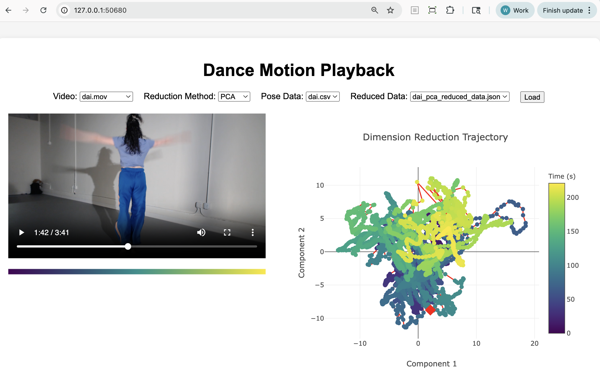

# Dance Motion Embedding System

A comprehensive system for converting dance videos into pose time series data using MediaPipe's AI pose estimation, generating vector embeddings for poses and movement segments, and enabling motion analysis in high-dimensional space.

## 🎯 Features

- **Pose Extraction**: Extract 2D and 3D pose landmarks from dance videos using MediaPipe
- **Embedding Generation**: Create vector embeddings for individual poses and 5-second movement segments
- **Motion Analysis**: Analyze motion patterns using dimensionality reduction and clustering
- **Visualization**: Interactive 3D visualizations using Plotly and Rerun
- **Live Prediction**: Framework for predicting future movements during live tracking
- **CSV Export**: Export pose data with timestamps for synchronized playback

## 🏗️ Architecture

The system consists of three main components:

1. **Pose Extraction** (`src/pose_extraction/`): Uses MediaPipe and Rerun to extract pose landmarks from videos
2. **Dimension Reduction** (`src/dimension_reduction/`): Creates visualizations and interactive analysis
3. **Embedding Generation** (planned): Will create vector embeddings using Transformer or LSTM models

## 📦 Installation

### Prerequisites

- **Python 3.9** (required; other versions are not supported due to MediaPipe and UMAP dependencies)
- [uv](https://docs.astral.sh/uv/) (recommended) or pip

### Quick Installation

1. **Clone the repository**:
   ```bash
   git@github.com:kinetecharts/dance-embedding.git
   cd motion_embedding
   ```

2. **Install Python 3.9** (if not already installed):
   - On macOS:
     ```bash
     brew install python@3.9
     ```
   - Or use [pyenv](https://github.com/pyenv/pyenv):
     ```bash
     pyenv install 3.9.18
     pyenv local 3.9.18
     ```

3. **Create and activate a virtual environment with Python 3.9**:
   ```bash
   uv venv --python 3.9
   source .venv/bin/activate
   ```

4. **Install using uv** (recommended):
   ```bash
   # Install uv if not already installed
   curl -LsSf https://astral.sh/uv/install.sh | sh
   
   # Install dependencies
   uv pip install -e .
   ```

5. **Or install using pip**:
   ```bash
   pip install -e .
   ```

6. **Run the installation script** (optional):
   ```bash
   python install.py
   ```

## 🚀 Quick Start

Get up and running in minutes with these simple steps:

1. **Create the data directory structure**:
   ```bash
   mkdir -p data/video data/poses data/analysis/dimension_reduction
   ```

2. **Add a dance video file**:
   ```bash
   # Copy your dance video to the data/video folder
   cp /path/to/your/dance_video.mp4 data/video/
   ```

3. **Extract pose data from the video**:
   ```bash
   # auto list videos and extract pose
   python -m pose_extraction.pose_extraction
 
   # or specify video
   python -m pose_extraction.pose_extraction --video data/video/dance_video.mp4
   ```
   This will create a CSV file with pose landmarks in `data/poses/`.

4. **Run dimension reduction and create visualizations**:
   ```bash
   # auto run
   python -m dimension_reduction.main
 
   # Basic visualization with default settings
   python -m dimension_reduction.main --video data/video/dance_video.mp4 --pose-csv data/poses/dance_video.csv
   
   # Or create combined visualization with video player
   python -m dimension_reduction.main --video data/video/dance_video.mp4 --combined
   ```
   This generates interactive plots and saves them to `data/analysis/dimension_reduction/`.

5. **Start the web application server**:
   ```bash
   cd src/dimension_reduction/webapp
   python server.py
   ```
   Open your browser to [http://127.0.0.1:50680/](http://127.0.0.1:50680/) to view interactive visualizations with synchronized video playback.

   

### Development Setup

For development, install with additional dependencies:

```bash
uv pip install -e ".[dev]"
```

## 🚀 Quick Usage

### Command Line Interface

Extract poses from a single video:
```bash
python -m pose_extraction.main --video data/video/dance.mp4
```

Extract poses from all videos in a directory:
```bash
python -m pose_extraction.main --input-dir data/video
```

Use Rerun visualization:
```bash
python -m pose_extraction.main --video data/video/dance.mp4 --use-rerun
```

### Python API

```python
from pose_extraction import PoseExtractionPipeline

# Initialize pipeline
pipeline = PoseExtractionPipeline(use_rerun=False)  # Set to True for visualization

# Run pose extraction pipeline
results = pipeline.run_full_pipeline("data/video/dance.mp4")

print(f"Pose data: {results['pose_csv_path']}")
```

### Individual Components

```python
from pose_extraction import PoseExtractor

# Extract poses
extractor = PoseExtractor(use_rerun=True)
pose_data = extractor.extract_pose_from_video("data/video/dance.mp4")
```

## 📁 Project Structure

```
motion_embedding/
├── src/pose_extraction/
│   ├── __init__.py              # Main package
│   ├── pose_extraction.py       # Pose extraction using MediaPipe
│   └── main.py                  # Pose extraction pipeline
├── src/dimension_reduction/
│   ├── main.py                  # Dimension reduction and visualization
│   └── webapp/                  # Web application
├── data/
│   ├── video/                   # Input video files
│   ├── poses/                   # Extracted pose CSV files
│   └── analysis/                # Analysis results and visualizations
├── examples/
│   └── basic_usage.py           # Usage examples
├── tests/
│   └── test_imports.py          # Basic tests
├── documents/                   # Documentation
├── pyproject.toml              # Project configuration
├── install.py                  # Installation script
└── README.md                   # This file
```

## 📊 Data Formats

### Pose CSV Format

The system exports pose data in CSV format with the following columns:

- `timestamp`: Frame timestamp in seconds
- `frame_number`: Frame index
- `{keypoint}_x`, `{keypoint}_y`: 2D coordinates for each keypoint
- `{keypoint}_z`: 3D coordinates (if available)
- `{keypoint}_confidence`: Confidence scores

Example:
```csv
timestamp,frame_number,nose_x,nose_y,nose_z,nose_confidence,...
0.0,0,320.5,240.2,0.1,0.95,...
0.033,1,321.1,239.8,0.12,0.94,...
```

## 🎨 Visualization

The system provides several visualization options:

1. **Rerun Visualization**: Real-time 3D pose tracking during extraction
2. **Plotly Interactive**: 3D embeddings, similarity matrices, and motion timelines
3. **Clustering Analysis**: Color-coded clusters in embedding space

### Enabling Rerun Visualization

```bash
python -m pose_extraction.main --video data/video/dance.mp4 --use-rerun
```

## 🔧 Configuration

### Pose Extraction Options

- **Rerun Visualization**: Real-time 3D pose tracking during extraction
- **Output Format**: CSV with timestamps and confidence scores
- **Keypoints**: 33 MediaPipe pose landmarks

### Dimension Reduction Methods

- **UMAP**: Uniform Manifold Approximation and Projection (default)
- **t-SNE**: t-Distributed Stochastic Neighbor Embedding
- **PCA**: Principal Component Analysis

## 📈 Performance

### Hardware Requirements

- **Python 3.9** (required)
- **CPU**: Intel i5 or equivalent (minimum)
- **RAM**: 8GB (minimum), 16GB (recommended)
- **Storage**: 1GB per minute of video (approximate)

### Optimization Tips

1. **Rerun**: Disable Rerun visualization for faster processing
2. **Batch Processing**: Process multiple videos in parallel
3. **Memory Management**: Use smaller video files for large datasets

## 🧪 Testing

Run the test suite:

```bash
# Run all tests
pytest

# Run with coverage
pytest --cov=pose_extraction

# Run specific test
python tests/test_imports.py
```

## 📚 Documentation

- [Requirements](documents/requirements.md): System requirements and goals
- [Architecture](documents/architecture.md): System design and components
- [Implementation Plan](documents/implementation-plan.md): Development roadmap
- [Technical Considerations](documents/technical-considerations.md): Technical details
- [Pose Extraction](documents/pose_extraction.md): Pose extraction specifications

## 🤝 Contributing

1. Fork the repository
2. Create a feature branch: `git checkout -b feature/new-feature`
3. Make your changes
4. Run tests: `pytest`
5. Commit your changes: `git commit -am 'Add new feature'`
6. Push to the branch: `git push origin feature/new-feature`
7. Submit a pull request

## 📄 License

This project is licensed under the MIT License - see the [LICENSE](LICENSE) file for details.

## 🙏 Acknowledgments

- [MediaPipe](https://mediapipe.dev/) for pose estimation
- [Rerun](https://rerun.io/) for visualization
- [PyTorch](https://pytorch.org/) for deep learning
- [Plotly](https://plotly.com/) for interactive visualizations

## 📞 Support

For questions and support:
- Create an issue on GitHub
- Check the documentation in `documents/`
- Review the examples in `examples/`

---

**Note**: This is an alpha version. The API may change in future releases. 